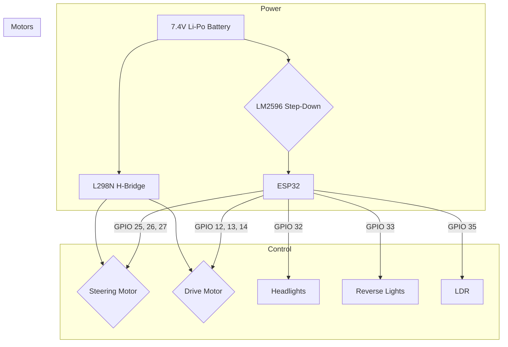
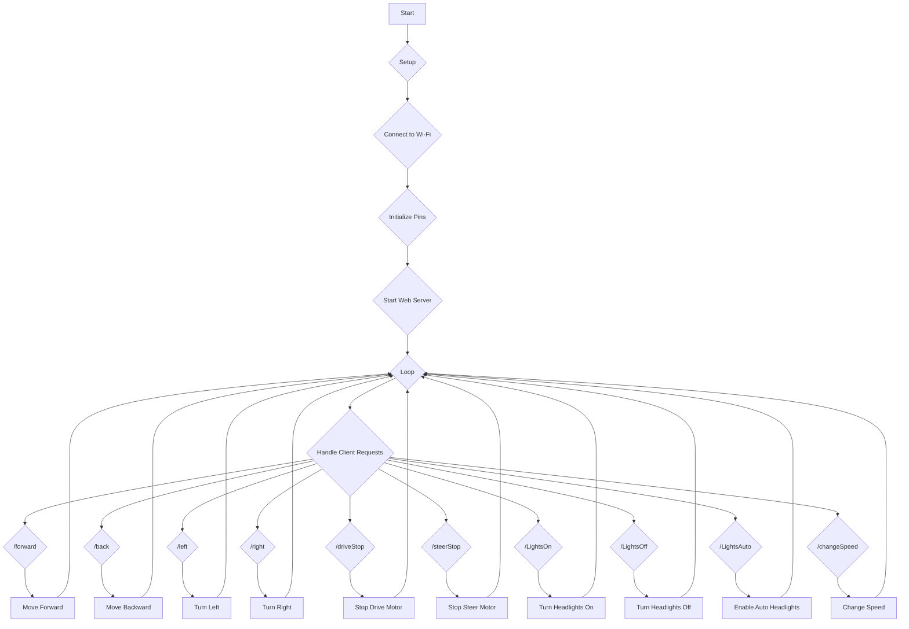

# RC Car with ESP32 - Documentation

This document provides a comprehensive overview of the ESP32-based RC car project, including hardware, software, and usage instructions.

## 1. Project Overview

This project transforms a standard RC car into a web-controlled vehicle using an ESP32 microcontroller. The car is controlled via a web interface hosted on the ESP32, accessible from any device on the same Wi-Fi network.

### Features:
- Web-based control for forward, backward, left, and right movements.
- Adjustable speed control via a slider on the web interface.
- Headlights with three modes: On, Off, and Automatic (using an LDR).
- Reverse lights that automatically turn on when the car is moving backward.
- 3D printed bumpers for mounting the lights.

## 2. Hardware

### 2.1. Components

| Component                 | Description                                                              |
| ------------------------- | ------------------------------------------------------------------------ |
| ESP32 DOIT DEVKIT V1      | The main microcontroller responsible for all operations.                 |
| L298N H-Bridge            | Controls the two DC motors for drive and steering.                       |
| LM2596 Step-Down Converter| Converts the 7.4V battery voltage to 5V to power the ESP32.              |
| LDR (Light Dependent Resistor) | Detects ambient light for the automatic headlight mode.                  |
| White LEDs                | Used for the headlights.                                                 |
| Red LED                   | Used for the reverse lights.                                             |
| 2x DC Motors (6.5V)       | One for driving the car, and one for steering.                           |
| 7.4V Li-Po Battery        | Powers the entire system.                                                |
| 3D Printed Bumpers        | Custom-designed front and rear bumpers to house the LEDs.                |
| WAGO Connectors           | For easy and secure wiring connections.                                  |
| Jumper Wires              | For connecting the components on the breadboard.                         |
| Chassis of an old RC car  | The base of the car, including wheels and steering mechanism.            |

### 2.2. Hardware Connection Diagram



## 3. Software

### 3.1. Overview

The software for this project is developed using the Arduino framework on PlatformIO. The ESP32 runs a web server that provides a user interface for controlling the car.

### 3.2. File Structure

```
.
├── README.md
├── platformio.ini
├── include/
├── lib/
├── src/
│   ├── main.cpp
│   ├── webpage.cpp
│   └── html/
│       └── index.html
├── stl/
│   ├── Paragolpe delantero rc-car.stl
│   └── Paragolpe trasero rc-car.stl
└── test/
```

- **`src/main.cpp`**: The main application file. It contains the logic for:
    - Connecting to Wi-Fi.
    - Setting up the web server and handling HTTP requests.
    - Controlling the motors and lights based on user commands.
    - Reading the LDR value for automatic headlight control.
- **`src/webpage.cpp`**: This file contains the HTML, CSS, and JavaScript for the web interface as a C++ raw string literal.
- **`src/html/index.html`**: The source HTML file for the web interface.
- **`platformio.ini`**: The PlatformIO project configuration file.
- **`stl/`**: Contains the STL files for the 3D-printed bumpers.

### 3.3. Software Flowchart



### 3.4. Libraries

- **`WiFi.h`**: For Wi-Fi connectivity.
- **`WebServer.h`**: For creating the web server.
- **`ESPmDNS.h`**: For mDNS to resolve the hostname `WifiCar.local`.
- **`Ticker.h`**: For periodically checking the LDR status in automatic headlight mode.

## 4. Setup and Installation

1.  **Hardware Assembly:** Connect the components as shown in the hardware connection diagram.
2.  **PlatformIO:** Open the project in Visual Studio Code with the PlatformIO IDE extension.
3.  **Wi-Fi Credentials:** Create a `wifi_data.h` file in the `include` directory with the following content:
    ```cpp
    #define SSID "YOUR_WIFI_SSID"
    #define PASSWORD "YOUR_WIFI_PASSWORD"
    ```
4.  **Build and Upload:** Build and upload the project to the ESP32.

## 5. Usage

1.  **Power On:** Power on the RC car. The ESP32 will connect to the configured Wi-Fi network.
2.  **Find IP Address:** Open the serial monitor to find the IP address of the ESP32, or navigate to `http://WifiCar.local`.
3.  **Control:** Open the IP address or the mDNS address in a web browser to access the control interface.

## 6. 3D Printed Parts

The `stl/` directory contains the STL files for the front and rear bumpers. These can be printed with any standard 3D printer.
